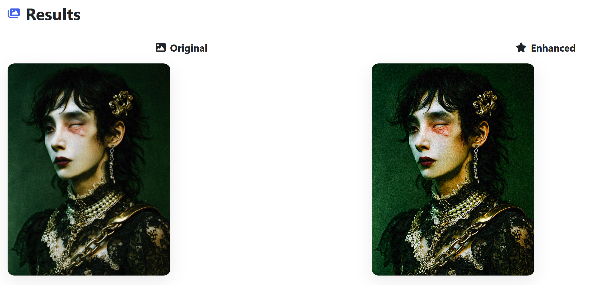
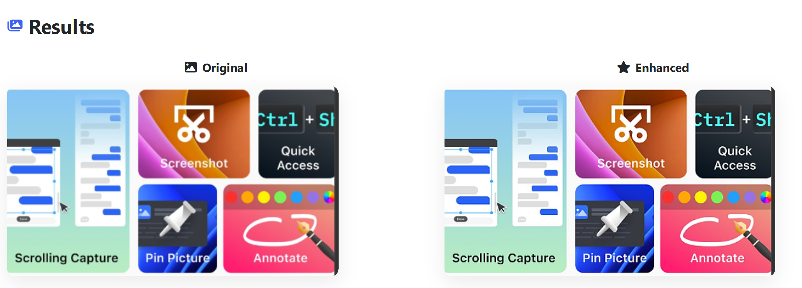

# image-enhancer
A python app to enhance an image

Copy and paste all of the following into the terminal:
python -m venv venv
source venv/bin/activate
pip install flask pillow
python app.py

# Examples

